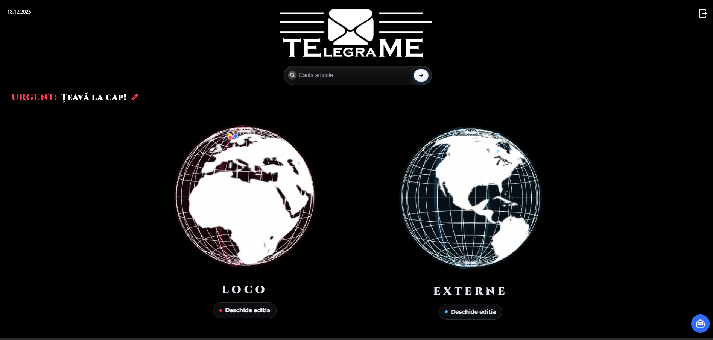
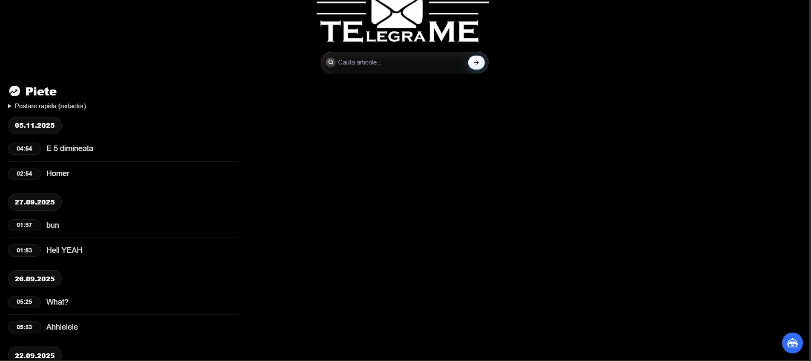
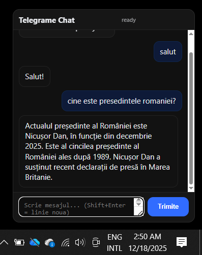
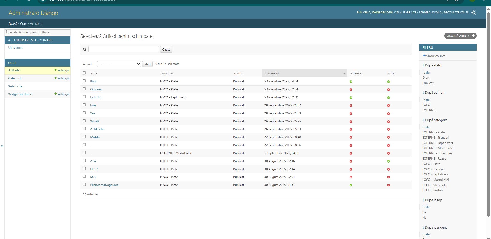

# AI News Website
A database-backed news platform enhanced with an AI layer — built to transform raw articles into structured, searchable, and digestible information in minimalist fashion.

Django-powered, template-driven, and designed with “portfolio-grade” clarity: features, setup, and visuals that speak for themselves.

---

## Highlights
- **News ingestion + persistence:** articles, categories, metadata stored in a database  
- **AI enrichment layer:** summaries / tagging / assistant-like chat (adaptable pipeline)  
- **Browsable UX:** Home, Categories, Archive, Article detail pages  
- **Search:** quickly locate articles by keywords  
- **Admin-ready:** manage content through Django Admin

---

## Tech Stack
- **Backend:** Django (Python)  
- **Database:** SQLite (dev) — PostgreSQL-ready  
- **Frontend:** Django Templates + Static Assets (CSS/JS)  
- **AI Layer:** API-based or local model integration (configurable)

---

## Screenshots






---

## ?? Quickstart (Local)
```bash
git clone https://github.com/Dimitri011/AI-News-WebSite.git
cd AI-News-WebSite
python -m venv venv
venv\Scripts\activate
pip install -r requirements.txt
python manage.py migrate
python manage.py runserver
